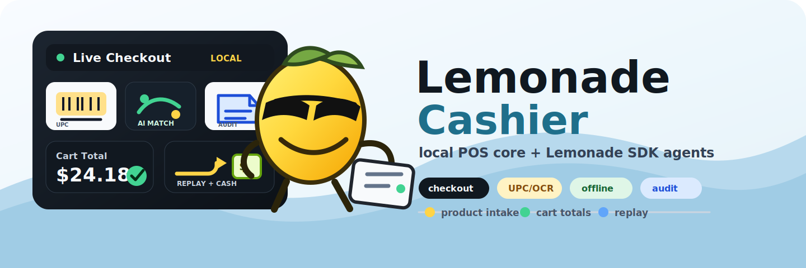

# Lemonade Cashier

[](https://github.com/bong-water-water-bong/lemonade-cashier/actions/workflows/ci.yml)
[](https://github.com/bong-water-water-bong/lemonade-cashier/actions/workflows/docs.yml)
[](https://github.com/bong-water-water-bong/lemonade-cashier/actions/workflows/codeql.yml)
[](https://github.com/bong-water-water-bong/lemonade-cashier/blob/main/pyproject.toml)
[](https://github.com/lemonade-sdk/lemonade)
[](#lemonade-cashier)
[](LICENSE)

<p align="center">
  
</p>

> A local-first cashier app for the Lemonade SDK ecosystem.

Lemonade Cashier is an offline-capable cashier assistant for the AMD
**Strix Halo** (Ryzen AI MAX+ 395 / XDNA2) workstation. It is designed as
a practical retail app built around [Lemonade Server](https://github.com/lemonade-sdk/lemonade):
deterministic checkout first, local Lemonade-powered agents second, and
camera/vision product onboarding as the next layer.

The core checkout model is intentionally **cash-only**. Cash tender,
change, receipts, audit replay, and cash-in-transit custody are the
first-class financial path. Stripe, card readers, wallets, and payment
processors can exist later as optional integrations, but they are not
part of the core cashier. Barter can be supported as an attendant-approved
exchange record later, but it must remain explicit, local, and auditable.

Built on the spec
*Lemonade Cashier — Complete Strix Halo Build Specification* with a
deliberate build order:

> **inventory → cart → totals → cash → receipts → audit → replay → CIT →
> safety → agents → cameras → speech → sensor fusion**
>
> *Reliability before autonomy.*

The deterministic financial core (everything up to "safety") runs with
**Python standard library only**. Agents and AI-assisted parsing are
optional and only consulted as a *fallback* — if Lemonade Server or
FastFlowLM is unreachable, the cashier degrades gracefully to its
rule-based primary path.

---

## Lemonade SDK app

This repository is a reference-style application for running a cashier
workflow beside Lemonade Server:

- **Lemonade Server** provides local OpenAI-compatible model access.
- **FastFlowLM** can provide NPU-backed fallback parsing when available.
- **Lemonade Eval** is the intended benchmark harness for model/server
  performance.
- The cashier core stays deterministic and testable even when every AI
  service is offline.

The app boundary is deliberate: Lemonade can propose normalized cashier
events, but it never becomes the authority for SKU, price, voids, refunds,
cash, or transaction close.

Payment boundary: the repository core is a cash-only cashier and CIT
system. Contributions that add payment providers belong behind optional
integration boundaries, not in `core/`, not in the deterministic close path,
and not as required runtime services.

---

## What's in this Phase 1.5 drop

| Layer | Status | Notes |
| --- | --- | --- |
| Money (Decimal, bankers' rounding) | ✅ | `core.money` |
| Inventory + aliases | ✅ | SQLite-backed, CSV-seeded, alias-aware matching |
| Cart / transaction | ✅ | Quantity, subtotal, tax, refund-aware |
| Cash + change | ✅ | `core.cash` |
| Receipts (text + JSON) | ✅ | `audit.receipts` |
| Append-only event log | ✅ | JSONL + hash chain (`audit.eventlog`) |
| Replay | ✅ | Pure-function replay of any closed transaction |
| CIT (cash-in-transit) | ✅ | Core cash custody: drops, pickups, till counts, two-person rule |
| CIT bags (chain of custody) | ✅ | Sealed → handoff → received → reconciled/discrepancy |
| Safety / risk scoring | ✅ | `safety.risk` |
| Safety: hashed PIN store | ✅ | PBKDF2-SHA256 200k, constant-time compare |
| Safety: PIN-failure lockout | ✅ | Event-projected per-attendant |
| Safety: per-attendant profile | ✅ | Voids, low-conf, discrepancies |
| Safety: tamper detection | ✅ | Clock skew, quiet gaps, open/close imbalance |
| Safety: end-of-shift report | ✅ | JSON + 80-col text |
| Agent supervisor (multi-agent) | ✅ | Permission states per actor |
| Lemonade Server client | ✅ | HTTP fallback parser (port 8000) |
| FastFlowLM (NPU) client | ✅ | HTTP fallback parser (port 11434) |
| GAIA hooks | ✅ | Optional bridge layer; install GAIA separately |
| Agent proposal audit trail | ✅ | `agent.proposal` events tied into the hash chain |
| Agent capability registry | ✅ | Each agent's permitted proposal kinds + actor roles |
| Q&A agent (read-only) | ✅ | `agents.qa_agent` — answers from event log, no cart mutations |
| EOS summarizer | ✅ | Natural-language wrapper over `safety.report` with deterministic fallback |
| PoE camera pipeline | 🚧 stubs | Interface only — not wired to model |
| Speech (ASR) | 🚧 stubs | Interface only |
| Sensor fusion | 🚧 stubs | Interface only |
| Eval runner | ✅ | `cashier.eval` + JSONL scenarios |

The 🚧 layers expose their **contracts** so later work can drop in
implementations without changing the rest of the system.

---

## Hardware target

- **AMD Ryzen AI MAX+ 395** with **XDNA2 NPU (`amdxdna`)** under Ubuntu.
- Local LLM stack: **Lemonade Server 10.4.0** on `:8000` and
  **FastFlowLM 0.9.42** on `:11434` (NPU-backed). Both are *optional*.
- Optional **GAIA 0.18.1** desktop UI / Python SDK (chat, RAG, MCP,
  IDE/voice/Blender agents) sits one layer above the cashier.

Nothing here requires a GPU at runtime. The financial core runs on
any laptop with Python 3.11+.

---

## Quick start

```bash
git clone https://github.com/bong-water-water-bong/lemonade-cashier.git
cd lemonade-cashier

# Optional: editable install with dev extras (pytest, ruff, mypy)
make install

# Seed the local product database from data/sample_products.csv
make seed

# Run the cashier CLI
make run

# Run tests
make test
```

The CLI accepts plain English-ish lines:

```text
> apple
Added apple at $0.75.

> two of those
Set last item quantity to 2.

> coke
Added Coca-Cola 12oz at $1.50.            ← matched via alias

> remove that
Removed Coca-Cola 12oz.

> milk
Low-confidence match: 'milk' → "milk 1 gal" at 0.86. Confirm? y/n > y
Added milk 1 gal at $3.49.

> total
Subtotal $2.25  Tax $0.11  Total $2.36

> cash 5.00
Change due: $2.64. Receipt saved to data/receipts/2026-05-17T20-55-12.json

> separate order
```

Type `quit` to exit. Any `state` command prints the current cart as
JSON (the same JSON shape `replay()` reconstructs).

---

## Architecture at a glance

```text
                ┌──────────────────────────────────────────────┐
                │              CLI / Operator Loop             │
                └─────────────┬────────────────────┬───────────┘
                              │                    │
                  ┌───────────▼─────────┐  ┌──────▼────────────┐
                  │  Agent Supervisor   │  │  JSON state out   │
                  │  (multi-agent,      │  │  (schema_version) │
                  │   permission gated) │  └───────────────────┘
                  └───────┬──────┬──────┘
                          │      │ (LLM fallback only;
                          │      │  Lemonade :8000 / FLM :11434)
                          │      └─────────────────────────────┐
                          ▼                                    │
                ┌──────────────────┐                  ┌────────▼───────┐
                │   Rule parser    │                  │ Local LLM proxy│
                └─────────┬────────┘                  └────────┬───────┘
                          │                                    │
                          └────────────┬───────────────────────┘
                                       ▼
                              ┌───────────────────┐
                              │   Risk / safety   │  ← `safety.risk`
                              │   gates           │
                              └─────────┬─────────┘
                                        ▼
       ┌─────────────────────────────────────────────────────────────────┐
       │              Deterministic Financial Core                       │
       │                                                                 │
       │  Inventory ──► Cart ──► Totals ──► Cash ──► Receipts ──► Audit  │
       │                                                       (hash    │
       │                                                        chain)  │
       └────────────────────────────────────┬────────────────────────────┘
                                            ▼
                              ┌───────────────────────────┐
                              │ Append-only JSONL events  │
                              │  + sidecar receipts       │
                              │  + CIT log                │
                              └─────────────┬─────────────┘
                                            ▼
                                  ┌──────────────────┐
                                  │  Pure-function   │
                                  │  Replay()        │
                                  └──────────────────┘

  (camera / ASR / sensor-fusion are Phase 2 — interfaces only)
```

The arrow direction is the rule: **events flow downward; outputs flow
back up; the AI agents never write to the financial core directly.**
They emit *candidate* parsed events that go through the same risk/
confidence/confirmation gates as a typed line.

---

## Files in the repo

```text
lemonade-cashier/
  AGENTS.md                          # Mission, safety rules, agent contract
  README.md                          # You are here
  docs/
    ARCHITECTURE.md                  # The full long-form architecture doc
    BUILD_ORDER.md                   # The spec's build order, annotated
    SAFETY.md                        # Risk model and money rules
  src/lemonade_cashier/
    __init__.py
    cli.py
    core/
      __init__.py
      money.py                       # Decimal-only money primitives
      inventory.py                   # SQLite product catalog + aliases
      cart.py                        # Cart lines, qty, subtotal, tax
      totals.py                      # Tax engine
      cash.py                        # Tendered cash + change
    audit/
      __init__.py
      eventlog.py                    # Append-only hash-chained JSONL
      receipts.py                    # Receipt rendering (text + JSON)
      replay.py                      # Pure-function replay()
    safety/
      __init__.py
      cit.py                         # Cash-in-transit, two-person rule
      risk.py                        # Risk scoring per transaction
      policy.py                      # Void/refund/discount policies
    agents/
      __init__.py
      parser.py                      # Rule-based parser (primary)
      supervisor.py                  # Multi-agent permission gating
      lemonade_client.py             # Local Lemonade Server HTTP client
      flm_client.py                  # FastFlowLM HTTP client
      gaia_bridge.py                 # Optional GAIA SDK adapter
    sensors/
      __init__.py
      camera.py                      # PoE camera interface stub
      speech.py                      # ASR interface stub
      fusion.py                      # Sensor fusion interface stub
    integrations/
      __init__.py
      eval.py                        # Deterministic eval runner
  data/
    sample_products.csv              # Catalog seed (with aliases)
    scenarios.jsonl                  # Replay/eval scenarios
  tests/
    test_money.py
    test_inventory.py
    test_cart.py
    test_cash.py
    test_eventlog.py
    test_replay.py
    test_cit.py
    test_risk.py
    test_parser.py
    test_supervisor.py
    test_cli_smoke.py
  scripts/
    seed_products.py
    replay.py
  .github/workflows/ci.yml
```

---

## Safety posture (the short version)

- **Money math is `decimal.Decimal` from end to end.** Floats never touch
  a price. The codebase has a test that fails the build if any module
  uses `float` for money.
- **Confidence is visible in the audit log**, not just in the UI. Every
  cart line records `source ∈ {attendant, agent_auto, agent_confirmed}`
  and the matching confidence.
- **The agent never names a price or picks a SKU.** It produces a
  candidate parsed event that goes through `find_product()` and
  confidence gating like any typed line.
- **Untrusted text never sees credentials.** The Lemonade/FLM clients
  send only the current cart shape and a strict response schema.
- **Receipts are append-only and hash-chained.** Any tamper or gap is
  detectable by `make replay`.
- **Cash-only is the core payment model.** CIT custody, drops, pickups,
  and bag handoff are audited locally. External payment providers are
  optional integrations only.

The long version lives in [`docs/SAFETY.md`](docs/SAFETY.md).

---

## Status

Phase 1.5. Deterministic. Auditable. Boring on purpose. The next
milestone is the LLM-assisted parser fallback (already stubbed at
`agents.lemonade_client`) — wired only after the rule-based parser
fails to match and only behind the existing confirmation gate.

Pull requests welcome. See [`AGENTS.md`](AGENTS.md) for the contract.
